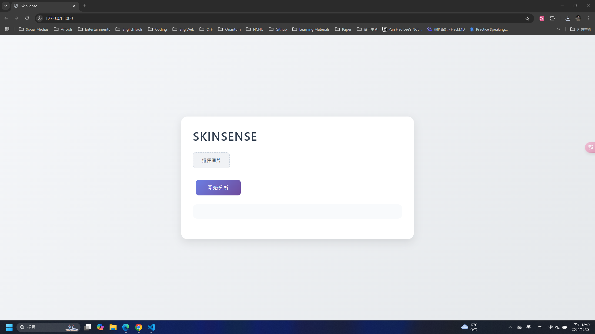
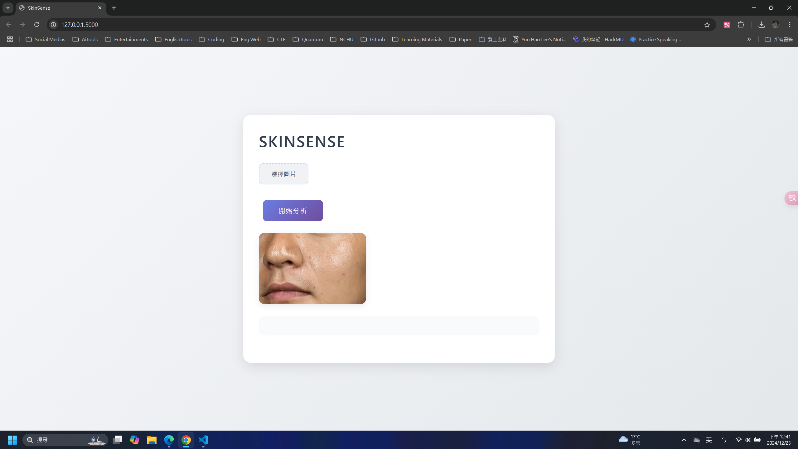
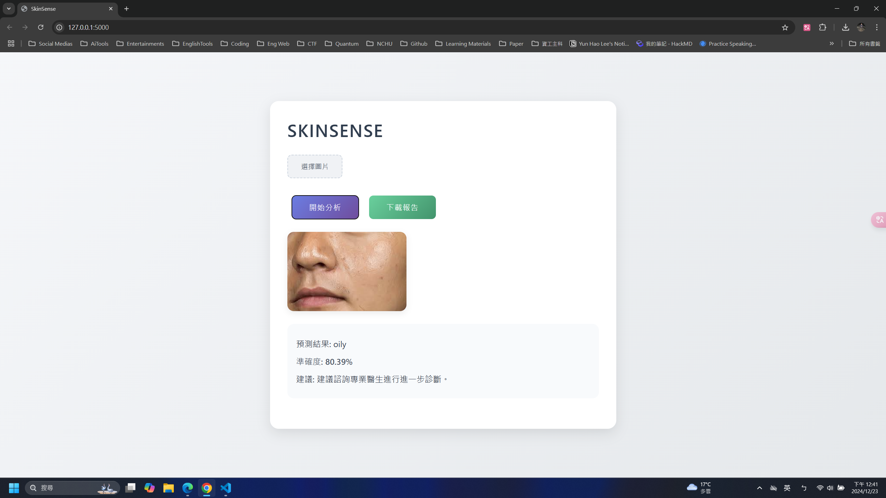

# SkinSense

一個讓使用者上傳照片分析自身是甚麼膚質的圖像分類模型，並且給予適合的保養品成分跟日常習慣建議

## 功能

- 提供使用者上傳照片進行分析
    - 痘痘肌
    - 油肌
    - 正常肌
    - 乾肌
- 給予能適用的保養品成份，而非直接推薦產品

## 技術

- 後端框架：Flask
- 深度學習框架：PyTorch
- 圖像處理：OpenCV
- 前端技術：
    - HTML
    - CSS3
    - JavaScript

## 安裝指南

在您的虛擬環境中使用 python 3.10，搭配以下指令下載所需套件
```python=
pip install -r requirements.txt
```

## 使用方法

1. 啟動服務器
    ```python=
    python app.py
    ```

2. 開啟瀏覽器訪問：http://localhost:5000

3. 使用步驟：
    - 點擊「上傳圖片」按鈕選擇要分析的臉部照片
    - 系統會自動進行膚質分析
    - 顯示分析結果與建議的保養成分
    - 可選擇下載詳細的 PDF 報告

## 資料集

使用 [face-skin-type](https://www.kaggle.com/datasets/muttaqin1113/face-skin-type) 和 [oily-dry-and-normal-skin-types-dataset](https://www.kaggle.com/datasets/shakyadissanayake/oily-dry-and-normal-skin-types-dataset) 混合，先對 先對 oily-dry-and-normal-skin-types-dataset 的 normal 類別做臉部提取，再將提取的結果分成臉部各個區域，最後進行資料清理

## 模型資訊
### baseline

利用預訓練模型 ResNet18、efficientNetB0、mobileNetV2，並且先比較這三種 baseline 效能，選擇方式是因為資料量不大，因此選擇參數量較小的模型來測試


### chosen model


## Demo
### 選擇您的臉部照片



### 進行分析並且提供結果下載成 PDF


